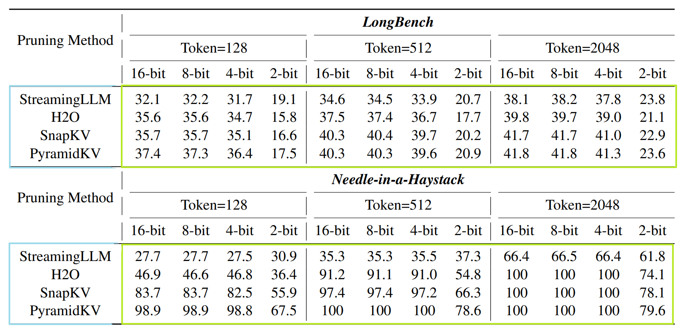
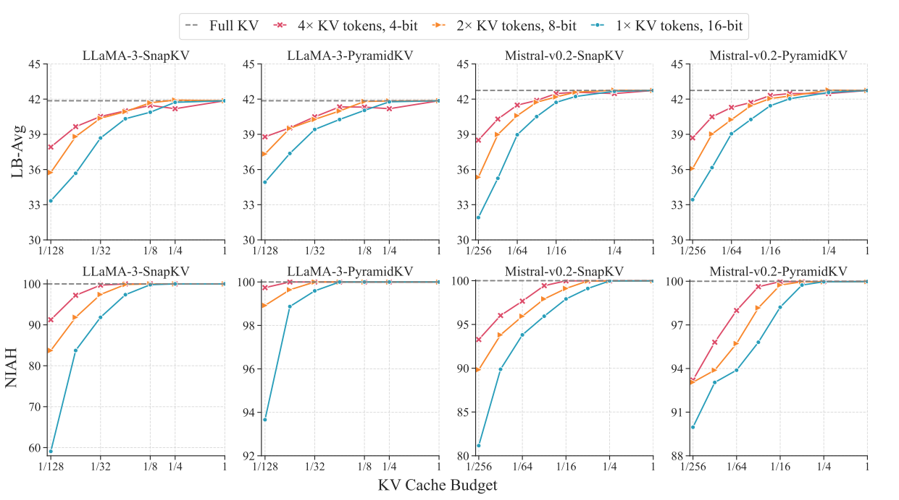

# More Tokens, Lower Precision: Towards the Optimal Token-Precision Trade-off in KV Cache Compression

This is the official implementation of our paper([arxiv](https://arxiv.org/pdf/2412.12706)). In this paper, we comprehensively investigate the token-precision trade-off in KV cache compression. Experiments demonstrate that storing more tokens in the KV cache with lower precision, i.e., quantized pruning, can significantly enhance the long-context performance of LLMs. Furthermore, quantized pruning demonstrates notable stability across different KV pruning methods, quantization strategies, and model scales, and show particular improvement in retrieval-related tasks.

## News
- [2025-01-5] Our method has been added to [KVCache-Factory](https://github.com/Zefan-Cai/KVCache-Factory/tree/main)!

## Highlight Results

Quantized pruning demonstrates notable stability across different KV pruning methods.

<p align="center">
     <br>
</p>

Experiments demonstrate that storing more tokens in the KV cache with lower precision can significantly enhance
the long-context performance of LLMs under different budgets. 

<p align="center">
     <br>
</p>


## Requirements

```python
transformers >= 4.42
flash-attn >= 2.5.9.post1
```

##  Installation

```python

git clone https://github.com/zhzihao/QPruningKV.git
cd QPruningKV
pip install -r requirements.txt .

```

## LongBench


We support inference code on `LongBench` to repuduce our result.

Please refer to `scripts/scripts_longBench/eval.sh` to modify the parameters according to your requirements.

The results presented in our paper in based on Flash Attention v2.

```bash
export CUDA_VISIBLE_DEVICES=$1

method=LayerQuant # Support PyramidKV, SnapKV, H2O, StreamingLLM,LayerQuant
max_capacity_prompts=128 # 128-2048 in paper
attn_implementation=flash_attention_2
source_path=$2
model_path=$3 # path to model
save_dir=${source_path}"results_long_bench" # path to result save_dir
# Quantized pruned KV cache
nbits=4 # Quantization bit-width support 8,4,2. Need to set quant_method first.
quant_method=layerquant # Support kivi kvquant and layerquant, default None. 
#Following three parameters are only for LayerQuant method
quant_layers_bits=8 
quant_begin_layers=0 
quant_end_layers=4
# set layers between begin_layers and end_layers to different bit-width, it will also adjust the token numbers
python3 run_longbench.py \
    --method ${method} \
    --model_path ${model_path} \
    --max_capacity_prompts ${max_capacity_prompts} \
    --attn_implementation ${attn_implementation} \
    --save_dir ${save_dir} \
    --use_cache True \
    --nbits ${nbits} \
    --quant_method ${quant_method} \
    --quant_layers_bits ${quant_layers_bits} \
    --quant_begin_layers ${quant_begin_layers} \
    --quant_end_layers ${quant_end_layers}


```

* model_path: Path to your model. Support Llama-3 and Mistral for now.
* method: Support `PyramidKV`, `SnapKV`, `StreamingLLM`, `H2O`,`LayerQuant`.
* max_capacity_prompts: Selected KV Size in each layer. （e.g. 128-2048 in paper）.
* save_dir: Path to your dir to save LongBench result.
* quant_method: kivi and kvquant can be used with  method PyramidKV, SnapKV, H2O, StreamingLLM.
* method LayerQuant and quant_method layerquant need to be used together.
* delete the parameters after nbits to use KV pruning method without quantization.  
  
After modifying parameters, run:

```bash 

sh scripts/scripts_longBench/eval.sh

```
## RULER

We also support inference code on `RULER` to repuduce our result.

Please refer to `scripts/scripts_ruler/eval.sh` to modify the parameters according to your requirements. The parameters are similar to LongBench.
## Needle in haystack

We support inference code on `Needle in haystack` to repuduce our result.

Please refer to `scripts/scripts_needle/eval.sh` to modify the parameters according to your requirements.


```

METHOD=pyramidkv       # ['full', 'pyramidkv', 'snapkv', 'streamingllm', 'h2o']
MAX_CAPACITY_PROMPT=96  # [64, 96, 128, 256, 512, 1024, 2048, ...]
attn_implementation="flash_attention_2" 
TAG=test
nbits=4 # Quantization bit-width support 8,4,2. Need to set quant_method first.
quant_method=kivi # Support kivi, default None.
model_path=$2
# For Llama3-8b

(
python -u run_needle_in_haystack.py --s_len 1000 --e_len 8001\
    --model_provider LLaMA3 \
    --model_name ${model_path} \
    --attn_implementation ${attn_implementation} \
    --step 100 \
    --method $METHOD \
    --max_capacity_prompt $MAX_CAPACITY_PROMPT \
    --model_version LlaMA3_${METHOD}_${MAX_CAPACITY_PROMPT}_${TAG} \
    --nbits ${nbits} \
    --quant_method ${quant_method} 
) 2>&1  | tee results_needle/logs/LlaMA3_${METHOD}_${MAX_CAPACITY_PROMPT}_${TAG}.log


```

* Both LLaMA3 and Mistral2 inference support on single GPU.
* model_provider: LLaMA3 or Mistral2
* model_name: Path to your model. Support "Llama-3" and "Mistral-v0.2" for now.
* step: The increase of context length.
* method: Support `PyramidKV`, `SnapKV`, `StreamingLLM`, `H2O`.
* max_capacity_prompt: Selected KV Size in each layer. （128-2048 in paper）. 
* quant_method & nbits: support kivi, set nbits to quantize the KV cache.


To reproduce our results, run

```
bash scripts/scripts_needle/eval.sh
```

After inference, run

`python scripts/scripts_needle/visualize.py` 

to draw the img, you should change `FOLDER_PATH` in `visualize.py` to your output path (the argument of `--model_version` in `eval.sh`).


## Citation

If you find our work useful for your research and applications, please kindly cite using this BibTeX:

```latex
@article{zhang2024more,
  title={More Tokens, Lower Precision: Towards the Optimal Token-Precision Trade-off in KV Cache Compression},
  author={Zhang, Jiebin and Zhu, Dawei and Song, Yifan and Wu, Wenhao and Kuang, Chuqiao and Li, Xiaoguang and Shang, Lifeng and Liu, Qun and Li, Sujian},
  journal={arXiv preprint arXiv:2412.12706},
  year={2024}
}
```

## Acknowledgement


Thanks **[PyramidKV]** [Pyramidkv: Dynamic kv cache compression based on pyramidal information funneling](https://github.com/Zefan-Cai/KVCache-Factory) for providing open-source code to support the expansion of this project.
